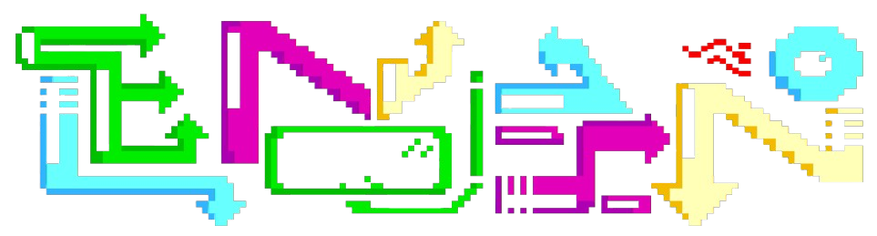

<a id="readme-top"></a>
<!-- SHIELDS -->

<p align='center'> 
  &nbsp;
  &nbsp;
  &nbsp;
  &nbsp;
</p>

<!-- PROJECT LOGO -->
<br>
<div align="center">
   
   <h3 align="center">El-MOLINO-v1.0</h3>
   <p align="center">
     An incredible visual and fun console GAME
     <br>
     <a href="https://github.com/ALX-13/El-Molino"><strong>Explore the docs »</strong></a>
     <br>
     <br>
     <a href="https://github.com/ALX-13/El-Molino">View Demo</a>
     ·
     <a href="https://github.com/ALX-13/ALX-13/issues/new?labels=bug&template=bug-report---.md">Report Bug</a>
     ·
     <a href="https://github.com/ALX-13/ALX-13/issues/new?labels=enhancement&template=feature-request---.md">Request Feature</a>
   </p>
</div>

<!-- TABLE OF CONTENTS -->
<details>
  <summary>Table of Contents</summary>
  <ol>
    <li>
      <a href="#about-the-proyect">About The Project</a>
      <ul>
        <li>
          <a href="#built-with">Built With</a>
        </li>
      </ul>
    </li>
    <li><a href="#important-notices">Important Notices</a></li>
    <li>
      <a href="#getting-started">Getting Started</a>
      <ul>
        <li><a href="#prerequisites">Prerequisites</a></li>
        <li><a href="#installation">Installation</a></li>
      </ul>
    </li>
    <li>
      <a href="#contributing">Contributing</a>
      <ul>
        <li>
          <a href="#top-contributors">Top Contributors</a>
        </li>
      </ul>
    </li>
    <li><a href="#contact">Contact</a></li>
  </ol>
</details>
<br>

<!-- ABOUT THE PROJECT -->
<a id="about-the-proyect"></a>***About The Project***


<div align="center">
  
</div>

El Molino is a console game developed in C++ that explores detailed graphics in a classic console environment. This project was created with the goal of providing a nostalgic and visually appealing experience, taking advantage of the power of ASCII graphics.

Here's why:

* My motivation for creating "El Molino" was to offer a classic game with detailed graphics, while improving my development skills.
* This game combines strategy and intelligence in a challenging console format, ideal for taking on a friend and testing your skills.
  
Of course, this is a trial version. In future updates, I will optimize the code to improve the gaming experience.

<a id="built-with"></a> 
### Built With
* &nbsp;
* &nbsp;
* &nbsp;
* &nbsp;
<p align="right">(<a href="#readme-top">back to top</a>)</p>

<!-- IMPORTANT NOTICES -->
<a id="important-notices"></a>***Important Notices***


> [!NOTE]  
> To install and run "El Molino", make sure you have the following:
> 
> | Requirement        | Description                                                                                       |
> |--------------------|---------------------------------------------------------------------------------------------------|
> | Operative System    |   |
> | IDE                |  |
> | Framework          |               |
 
> [!IMPORTANT]\
> We are a small team, but we are committed to improving "El Molino". Expect continuous updates to improve performance, graphics and gameplay.
<p align="right">(<a href="#readme-top">back to top</a>)</p>

<!-- GETTING STARTED -->
<a id="getting-started"></a>***Getting Started***

These are instructions on how to configure your project locally. To get a local copy up and running, follow these simple example steps.

<a id="prerequisites"></a>
### Prerequisites
These are the items needed to use the software and how to install them:
* C++ compiler (for example, GCC or Clang)
* Development environment (Visual Studio IDE)

<a id="installation"></a>
### Installation
_Below is an example of how to install and configure "El Molino" on your local machine._

1. Clone the repository
   ```sh
   git clone https://github.com/AAL1X/El_Molino-v1.0.git
   ```
2. Navigate to the project directory
   ```sh
   cd El_Molino-v1.0
   ```
3. Compile the project If you are using a C++ compiler such as `g++`,
you can compile the main file. Make sure you include all necessary files.
   ```sh
   g++ -o ElMolino main.cpp
   ```
4. Run the game
   ```sh
   ./ElMolino
   ```
5. (Optional) Change the Git remote URL to prevent accidental pushes to the base project
   ```sh
   git remote set-url origin https://github.com/tu_usuario/el_molino
   git remote -v #confirm the changes
   ```
<p align="right">(<a href="#readme-top">back to top</a>)</p>

<!-- CONTRIBUTING -->
<a id="contributing"></a>***Contributing***

Contributions are what make the open source community an amazing place to learn, be inspired, and create. Any contribution you wish to make is very welcome!

If you have a suggestion to improve the project, you can fork the repository and open a pull request.
Don't forget to give the project a star! Thanks for contributing!

1. Fork the project.
2. Create a branch for your improvement (`git checkout -b feature/NewImprovement`).
3. Make your changes and commit (`'git commit -m 'Add New Improvement'`).
4. Push your changes to the branch (`git push origin feature/NewImprovement`).
5. Open a pull request.

<a id="top-contributors"></a>
### Top contributors:
<div align="center">
  <a href="https://github.com/MichaelVL2023"></a>
</div>
<p align="right">(<a href="#readme-top">back to top</a>)</p>

<!-- CONTACT -->
<a id="contact"></a>***Contact***

<p align="center">
  <a href="mailto:leonardobravoricapa@gmail.com"></a>
  <a href="https://www.instagram.com/leonm.br"></a>
  <!-- <a href="https://aal1x-jobhub.github.io/jobhub-landing/"></a> -->
  <a href="https://www.linkedin.com/in/leonardo-bravo-4120b8228/"></a>
</p>
<p align="right">(<a href="#readme-top">back to top</a>)</p>
